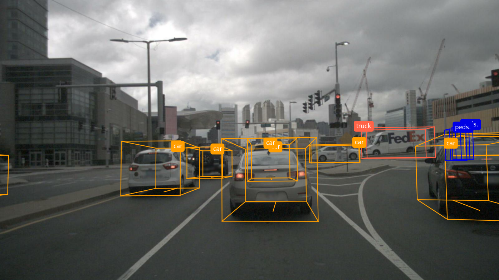
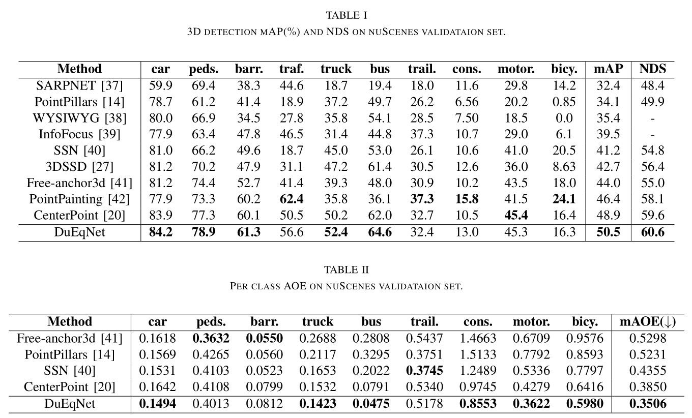

## DuEqNet: Dual-Equivariance Network in Outdoor 3D Object Detection for Autonomous Driving

By Xihao Wang, Jiaming Lei, Hai Lan, Arafat Al-Jawari, Xian Wei

## Introduction

This repository is the implementation of the paper ['DuEqNet: Dual-Equivariance Network in Outdoor 3D Object Detection for Autonomous Driving'](https://arxiv.org/abs/2302.13577).

An visualization example from the front camera.


An visualization example from the top lidar.


## Usage

### Installation

The repo is tested successfully on python=3.7, pytorch=1.11.0, cuda=11.1, [mmdetection3d=1.0.0rc3](https://github.com/open-mmlab/mmdetection3d).

Follow instructions below to install this repo:

1. Create a conda environment with Anaconda

2. Install pytorch=1.11.0 and cuda=11.1.

3. Follow the instructions in [mmdetection3d](https://mmdetection3d.readthedocs.io/en/latest/get_started.html) to install mmdetection3d=1.0.0rc3. The code of mmdetection3d=1.0.0rc3 is provided in this repo.

```
cd ./mmdetection3d-v1.0.0rc3
pip install -v -e .
cd ../
```

4. Update files in mmdetection3d with dueqnet module.
```
cp -rT dueqnet mmdetection3d-v1.0.0rc3/
```

### Training
DuEqNet is trained and evaluated on the whole nuScenes dataset. Download and prepare [nuScenes] following the [instructions](https://mmdetection3d.readthedocs.io/en/latest/advanced_guides/datasets/nuscenes_det.html) from mmdetection3d.

- Train with multi gpus
```
# dir: ./mmdetection3d-v1.0.0rc3
# CUDA_VISIBLE_DEVICES=0,1,2,3,4,5,6,7 bash ./tools/dist_train.sh configs/dueqnet/dueqnet_02pillar_Lefe_Gefe_4x8_cyclic_20e_nus.py
bash ./tools/dist_train.sh configs/dueqnet/dueqnet_02pillar_Lefe_Gefe_4x8_cyclic_20e_nus.py
```
- Or train with single gpu
```
# dir: ./mmdetection3d-v1.0.0rc3
CUDA_VISIBLE_DEVICES=0 python ./tools/train.py configs/dueqnet/dueqnet_02pillar_Lefe_Gefe_4x8_cyclic_20e_nus.py
```

### Evaluation
```
# dir: ./mmdetection3d-v1.0.0rc3
CUDA_VISIBLE_DEVICES=0 python ./tools/test.py configs/dueqnet/dueqnet_02pillar_Lefe_Gefe_4x8_cyclic_20e_nus.py ./work_dirs/dueq_checkpoint --eval bbox
```

The evaluation results are shown below:



## License

This repo is released under the [Apache 2.0 license](./mmdetection3d-v1.0.0rc3/LICENSE).

## Citation

Hope our work can help your job, please consider citing our paper.

```latex
@article{wang2023dueqnet,
  title={DuEqNet: Dual-Equivariance Network in Outdoor 3D Object Detection for Autonomous Driving},
  author={Wang, Xihao and Lei, Jiaming and Lan, Hai and Al-Jawari, Arafat and Wei, Xian},
  journal={arXiv preprint arXiv:2302.13577},
  year={2023}
}
```

## Acknowledgements

Our job benefits from [mmdetection3d](https://github.com/open-mmlab/mmdetection3d). It's a great job for 3d detection.

## Contact

Any problem, please feel free to contact [xihaowang2016@gmail.com](xihaowang2016@gmail.com) or [lanhai09@fjirsm.ac.cn](lanhai09@fjirsm.ac.cn).

